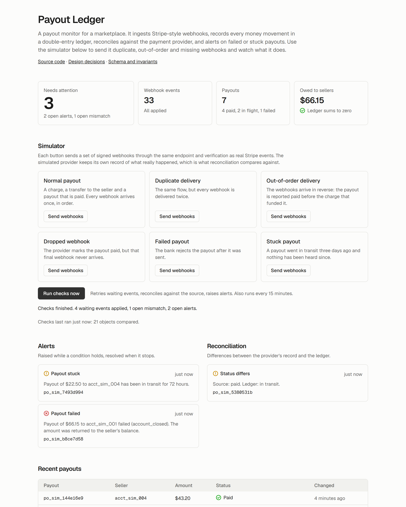
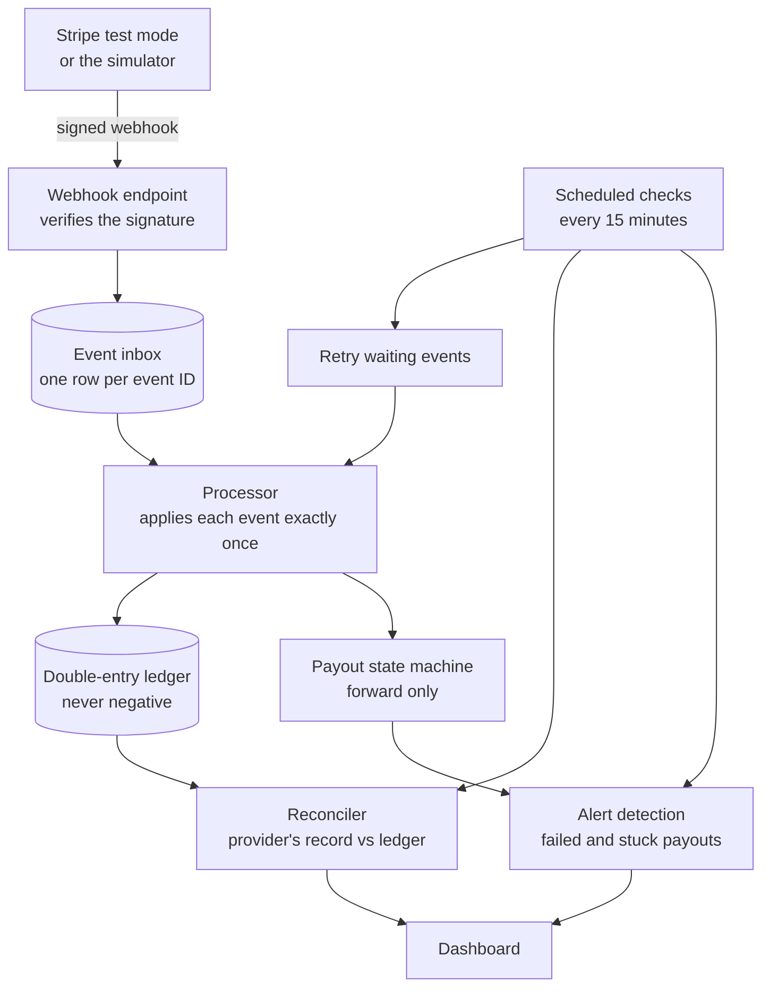

# Payout Ledger

A payout monitor for a marketplace: it ingests Stripe webhooks idempotently, records every money movement in a double-entry ledger that cannot go negative, reconciles against the payment provider, and alerts on failed or stuck payouts.

**Live demo:** https://payout-ledger-gamma.vercel.app · [](https://github.com/JalelDridi/payout-ledger/actions/workflows/ci.yml)

The demo has a built-in simulator. Send it duplicate, out-of-order or dropped webhooks, press "Run checks now", and watch what it catches.



## The problem

A marketplace takes payments from buyers and pays sellers out. The payment provider reports what happened through webhooks, and webhooks are unreliable in specific, documented ways:

- the same event can be delivered more than once;
- events can arrive in a different order than they happened;
- an event can be lost entirely.

A system that trusts each webhook as it arrives will, sooner or later, pay a seller twice, show a failed payout as paid, or lose track of money without noticing. This project is a small, complete answer to that: every failure above is handled, tested, and reproducible in the demo.

## How it works



1. **Receive.** The endpoint verifies the `Stripe-Signature` header against the raw body, then stores the event. The event ID is the primary key, so a duplicate is rejected by the database.
2. **Apply.** In one transaction, the processor locks the event, applies it and marks it processed. A crash or a second worker can never apply it twice.
3. **Record.** Money movements are posted as balanced ledger transactions. Payout status moves through a state machine that only goes forward.
4. **Check.** On a schedule, the system retries events that could not be applied yet, compares its records with the provider's, and raises or resolves alerts.

## Failure modes handled

| What goes wrong                                        | What the system does                                                                  | Proven by                                                                |
| ------------------------------------------------------ | ------------------------------------------------------------------------------------- | ------------------------------------------------------------------------ |
| The same webhook arrives twice                         | Stored once (primary key on the event ID), applied once                               | [`inbox.db.test.ts`](src/events/inbox.db.test.ts)                        |
| Ten workers pick up the same event                     | One applies it; the rest skip (`FOR UPDATE SKIP LOCKED`)                              | [`inbox.db.test.ts`](src/events/inbox.db.test.ts)                        |
| A payout's events arrive out of order                  | The state machine ignores a status older than the current one                         | [`transitions.test.ts`](src/payouts/transitions.test.ts)                 |
| A payout arrives before the transfer that funds it     | It fails cleanly, waits in the inbox, and succeeds on a later retry                   | [`inbox.db.test.ts`](src/events/inbox.db.test.ts)                        |
| Any mix of the above                                   | The final state is the same for every delivery order                                  | [`ordering.db.test.ts`](src/events/ordering.db.test.ts) (property-based) |
| 25 payouts race for a balance that covers 10           | Exactly 10 go through; the balance ends at zero, never below                          | [`inbox.db.test.ts`](src/events/inbox.db.test.ts)                        |
| A webhook is never delivered                           | Reconciliation flags the difference between the provider and the ledger               | [`run.db.test.ts`](src/reconcile/run.db.test.ts)                         |
| A payout fails, even after being marked paid           | The amount is returned to the seller with a reversing entry; an alert is raised       | [`inbox.db.test.ts`](src/events/inbox.db.test.ts)                        |
| A payout sits in transit for days                      | An alert is raised, and resolved when the payout moves on                             | [`run.db.test.ts`](src/simulator/run.db.test.ts)                         |
| A forged or replayed webhook                           | Rejected: bad signature, or a timestamp outside the tolerance window                  | [`verify.test.ts`](src/events/verify.test.ts)                            |
| Application code has a bug and writes a bad ledger row | The database refuses unbalanced transactions, overdrafts and any edit to a ledger row | [`invariants.db.test.ts`](src/db/invariants.db.test.ts)                  |

## Key design decisions

Each decision is recorded with the options considered and the trade-offs, in [`docs/decisions`](docs/decisions).

| Decision                                                                                                           | In one line                                                                                                  |
| ------------------------------------------------------------------------------------------------------------------ | ------------------------------------------------------------------------------------------------------------ |
| [Row locks, with constraints as a backstop](docs/decisions/0003-concurrency-row-locks-with-constraint-backstop.md) | Lock accounts in a fixed order to avoid deadlocks; a CHECK constraint holds even if the application is wrong |
| [Inbox table before processing](docs/decisions/0004-webhook-processing-inbox-table.md)                             | Acknowledge fast, keep every raw event, deduplicate in the database                                          |
| [Forward-only state machine](docs/decisions/0005-out-of-order-events-one-way-state-machine.md)                     | Delivery order stops mattering                                                                               |
| [Fail and retry, never go negative](docs/decisions/0007-cross-object-ordering-retry-not-reorder.md)                | An event that arrives too early waits; the ledger never shows a state that did not happen                    |
| [Reconcile against the source](docs/decisions/0008-reconciliation-source-of-truth.md)                              | Webhooks alone cannot detect a missing webhook                                                               |
| [Prisma, with raw SQL where it stops](docs/decisions/0002-database-access-prisma-with-raw-sql.md)                  | Invariants live in SQL, not in application code                                                              |
| [Scheduling from GitHub Actions](docs/decisions/0006-scheduling-github-actions.md)                                 | The hosting plan's cron runs once a day; the checks need to run more often                                   |

The database rules are described in [`docs/schema.md`](docs/schema.md).

## Run locally

Needs Node 22+, pnpm and Docker.

```bash
pnpm install
pnpm db:up
pnpm test:db
pnpm dev
```

`pnpm db:up` starts Postgres on port 5433 and `pnpm test:db` applies the migrations to it. The development server reads its local settings from the committed `.env.development`, which contains no real secrets.

## Tests

```bash
pnpm test        # unit tests
pnpm test:db     # against real Postgres: constraints, concurrency, property-based ordering
pnpm test:e2e    # Playwright: the demo flow and an accessibility scan (run pnpm build first)
```

Database and end-to-end tests refuse to run against anything but a local Postgres. CI runs lint, formatting, type checks and all three suites on every push.

## Stack

Next.js (App Router) and TypeScript on Vercel, PostgreSQL on Neon, Prisma, Stripe's SDK for signature verification, Vitest, fast-check, Playwright, GitHub Actions. Everything runs on free tiers.

## Limitations

- **The simulator stands in for Stripe.** Real Stripe events are accepted at the same endpoint, but reconciliation compares against the simulator's record, not the Stripe API. An API-backed source is the next step and needs no change to the comparison logic.
- **Stripe fees, refunds and disputes are not modelled.** A charge credits the platform with the full amount.
- **One currency.**
- **The reconciler reports; it does not repair.** A mismatch is flagged for a person to act on.
- **No accounts.** The demo is public, so the simulator's rate limit is global rather than per visitor, and the data resets every night.
- **Alerts are shown in the dashboard only.** There is no email, Slack or pager delivery.
- **Retries are not spaced out.** A waiting event is retried on every run of the checks, up to 8 attempts, without backoff.

## What I would do next

1. Reconcile against the Stripe API in test mode.
2. Deliver alerts to a chat webhook.
3. Add refunds, with their own reversing entries.
4. A per-seller statement built from ledger entries.

## Author

Built by [Mohamed Jalel Dridi](https://jaleldridi.vercel.app).

## Licence

MIT
